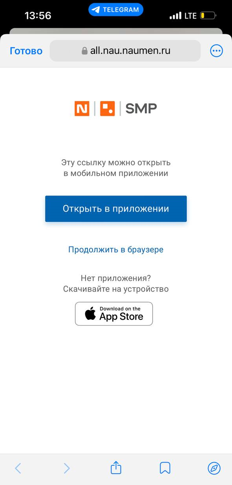

# Переход по ссылкам. iOS

[Для Android](../how-to-use-2/links-2)

Ссылка на приложение SMP может быть размещена:

- Внутри мобильного приложения в атрибутах типа "Гиперссылка" и "Текст в формате RTF". Также ссылка может содержаться в атрибутах типа "Текст", "Строка" и комментариях.
- В сторонних программах (почтовый клиент, месседжеры).

    В настройках мобильного приложения можно выбрать способ открытия ссылки на приложение SMP из сторонних источников: в мобильном приложении или в браузере, или только в браузере, (см. [Настройка перехода по ссылкам](../how-to-setup/other/other-settings#01)).

#### Ссылки на приложение SMP могут открываться в мобильном приложении или в браузере

В настройках мобильного приложения включен параметр "Предлагать открывать ссылки на объекты системы, полученные из сторонних источников, внутри мобильного приложения".

Если ссылка поддерживается мобильным приложением, то при переходе по ссылке на приложение SMP в сторонних программах открывается экран выбора способа открытия ссылки.

- Открыть в приложении — ссылка будет открыта в мобильной версии приложения.
- Продолжить в браузере — ссылка будет открыта в веб-версии приложения.

Доступны ссылки на карточки, формы добавления и редактирования.

Если ссылка не поддерживается мобильным приложением, то ссылка сразу открывается в браузере.

#### Ссылки открываются только в браузере

В настройках мобильного приложения отключен параметр "Предлагать открывать ссылки на объекты системы, полученные из сторонних источников, внутри мобильного приложения" и все ссылки всегда открываются только в браузере, даже если мобильное приложение их поддерживает.
