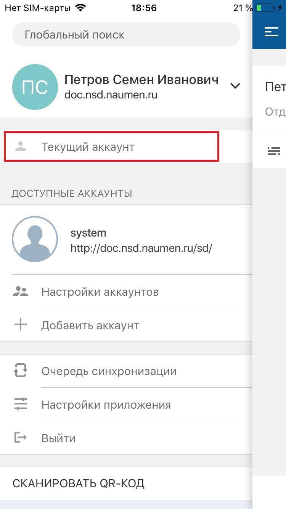
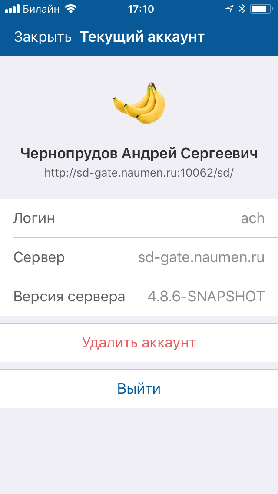
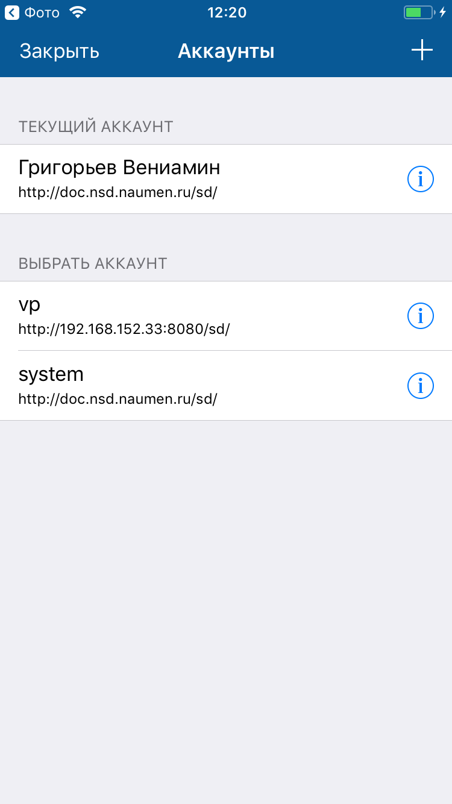
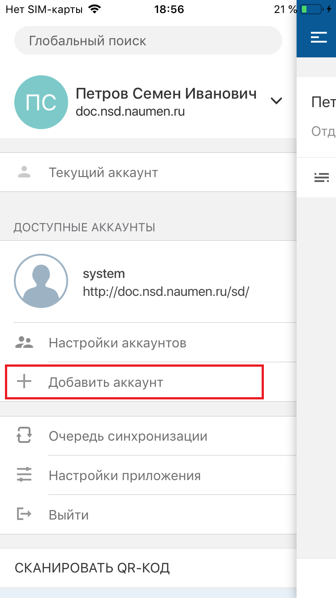
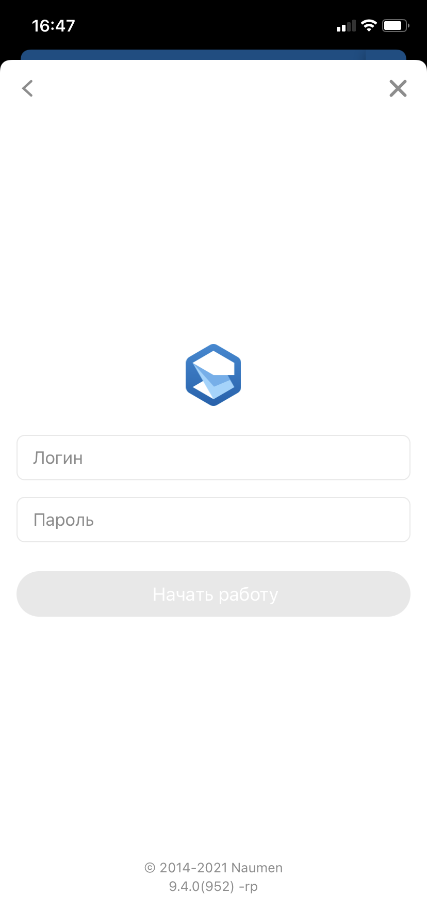
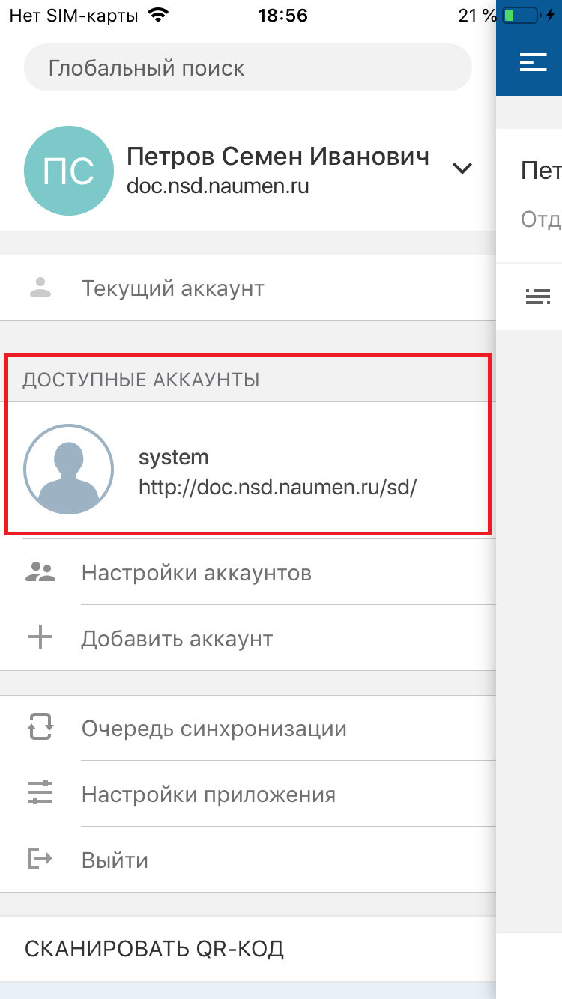
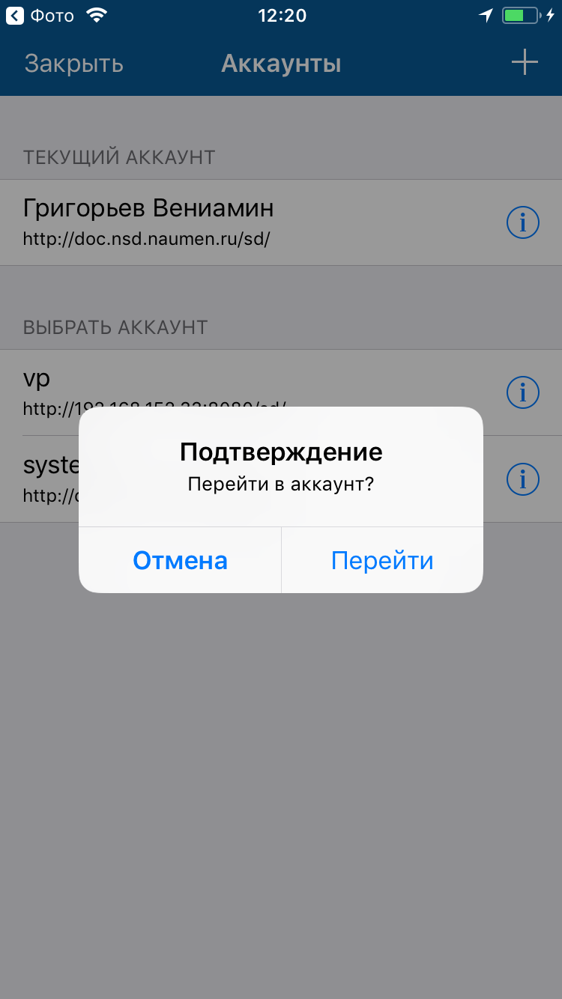
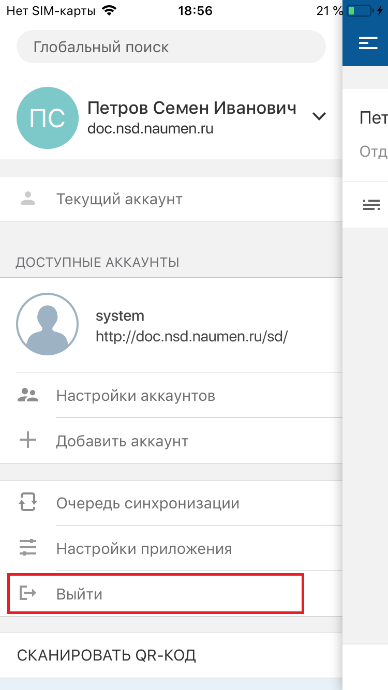

# Аккаунты. iOS

[Для Android](../../../how-to-use-2/navigation-2/settings-2/accounts-2)

- [Просмотр текущего аккаунта](./accounts#current)
- [Добавление аккаунта](./accounts#creation)
- [Удаление аккаунта](./accounts#dell)
- [Смена активного аккаунта](./accounts#change)
- [Выход из аккаунта](./accounts#exit)

### Просмотр информации об аккаунте {#current}

Аккаунт — совокупность данных, однозначно идентифицирующая конкретного пользователя конкретного приложения на базе платформы SMP: логин, пароль, сервер.

### Экран "Текущий аккаунт"

#### Переход к экрану

Меню мобильного приложения "Текущий аккаунт" → экран текущего аккаунта.

#### Содержание экрана

На экране отображаются параметры аккаунта:

- Логин;
- Сервер;
- Версия сервера.

Все параметры недоступны для редактирования.

### Экран "Аккаунты"

#### Переход к экрану

Меню мобильного приложения "Настройки аккаунтов" → экран "Аккаунты".

Меню мобильного приложения "Настройки приложения" → экран "Настройки" → "Управление аккаунтами" → экран "Аккаунты".

#### Содержание экрана

На экране "Аккаунты" отображается список доступных аккаунтов.

#### Навигация на экране

- Иконка возврата к предыдущему экрану.
- При нажатии на   (в строке аккаунта справа) выполняется переход на экран доступного аккаунта.

### Экран доступного аккаунта

#### Переход к экрану

На экране "Аккаунты" нажмите иконку  в строке аккаунта справа.

#### Содержание экрана

На экране доступного аккаунта отображаются параметрами доступного аккаунта.

#### Навигация на экране

- Иконка возврата к предыдущему экрану.

    При длинном нажатии (лонгтап) на иконку возврата открывается история посещений. Она отображается поверх экрана и содержит ссылки на ранее посещенные экраны: верхняя — на предыдущий экран, нижняя — на первый посещенный экран. Также в истории посещений отображаются переходы по пуш-сообщению или по ссылке на экран карточки.
    Чтобы скрыть историю посещений, нажмите вне ее области. 
    История посещений сбрасывается, если открывается меню приложения. 
    История посещений сохраняется в кеше приложения, обеспечивая доступ по ссылкам в офлайн-режиме.

### Добавление аккаунта {#creation}

#### Описание

Аккаунт создается автоматически при входе в мобильное приложение с новыми параметрами авторизации, также аккаунт можно добавить вручную.

Добавление выполняется на форме добавления аккаунта, форма состоит из двух экранов. Первый экран предназначен для ввода адреса сервера. Второй экран предназначен для аутентификации пользователя и зависит от настройки типа аутентификации в системе.

#### Выполнение действия

- В меню мобильного приложения

    В меню мобильного приложения нажмите "Добавить аккаунт".

    

    На первом экране введите адрес сервера, нажмите **Далее** и заполните поля на втором экране.

    При использовании системной аутентификации укажите логин и пароль и нажмите **Начать работу**.

    
- В списке аккаунтов

    Место действия: меню мобильного приложения "Настройки аккаунтов" → экран "Аккаунты".

    На экране "Аккаунты" нажмите + на верхней панели справа.

    

    На экране "Добавление аккаунта" заполните параметры и нажмите **Готово** на верхней панели справа. Аккаунт будет добавлен.

### Удаление аккаунта {#dell}

Аккаунт можно удалить.

#### Место в интерфейсе

Меню мобильного приложения "Настройки аккаунтов" → экран "Аккаунты".

#### Выполнение действия

На экране "Аккаунты" нажмите иконку  в строке аккаунта справа. На экране аккаунта нажмите "Удалить аккаунт".

### Смена активного аккаунта {#change}

В мобильном приложении доступна мультиаккаунтность — возможность переключаться между различными аккаунтами (учетными записями), не выходя из них.

#### Выполнение действия

- В меню мобильного приложения

    В меню мобильного приложения выберите один из доступных аккаунтов.

    
- В списке аккаунтов

    Место действия: меню мобильного приложения "Настройки аккаунтов" → экран "Аккаунты".

    На экране "Аккаунты" выберите один из доступных аккаунтов и на виджете подтверждения смены аккаунта нажмите "Подтвердить".

    Текущий активный аккаунт отображается в блоке "Текущий аккаунт".

    

    

### Выход из аккаунта {#exit}

#### Выполнение действия

Чтобы выйти из аккаунта в мобильном приложении, разверните меню приложения и нажмите **Выйти**.

#### Результат действия

Поведение активной сессии при выходе из аккаунта зависит от доступности сервера приложения в момент выхода.

Если сервер приложения доступен, то:

- Активная сессия завершается в мобильном приложении, а также в веб-интерфейсе.
- Push-уведомления перестают приходить на мобильное устройство.

Если сервер приложения недоступен (независимо от причины):

- Активная сессия не завершается до истечения ее времени жизни.
- Push-уведомления продолжают приходить на мобильное устройство.
- При переходе по уведомлению требуется авторизация пользователя в мобильном приложении.

<note type="info">

При использовании JWT-авторизации возможен принудительный выход из аккаунта при смене пароля по инициативе пользователя, принудительной смены пароля и выполнения api-методов инвалидации JWT-токенов.
При принудительном выходе отзываются JWT-токены. Если при этом у пользователя нет активной сессии в веб-интерфейсе, то освобождается лицензия.

</note>
