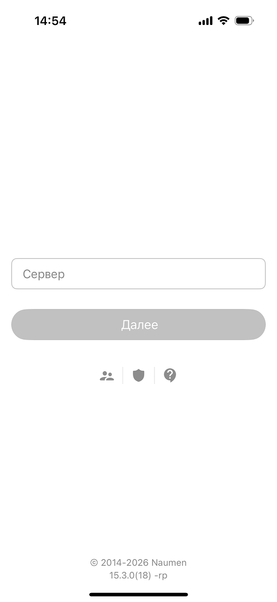
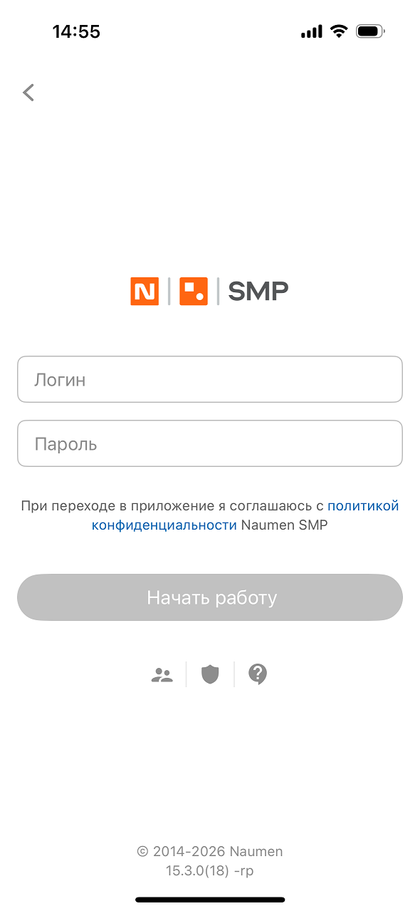
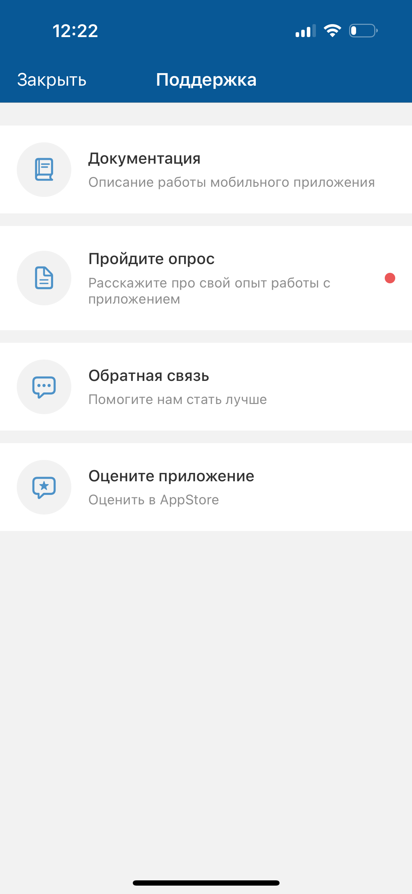

# Поддержка. iOS

[Для Android](../../../how-to-use-2/navigation-2/settings-2/support-2)

#### Описание

На экране "Поддержка" пользователь может: перейти в документацию, пройти опрос на лендинге, оставить обратную связь через форму, поставить оценку в магазине приложений.

#### Переход к экрану

- Меню мобильного приложения "Поддержка" → экран "Поддержка".

    
- Первый и второй экраны входа → иконка  → экран "Поддержка".

     

#### Содержание экрана

- плашка "Документация" — ссылка для перехода в документацию;
- плашка "Пройдите опрос" — ссылка для перехода к опросу на лендинге;
- плашка "Обратная связь" — ссылка на форму обратной связи;
- плашка "Оцените приложение" — ссылка для перехода в магазин приложений.

