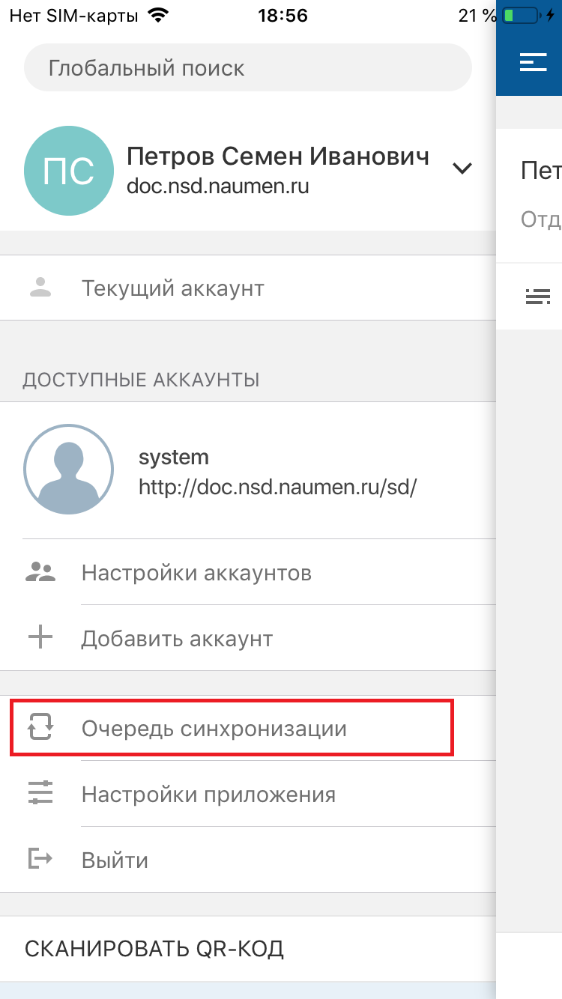
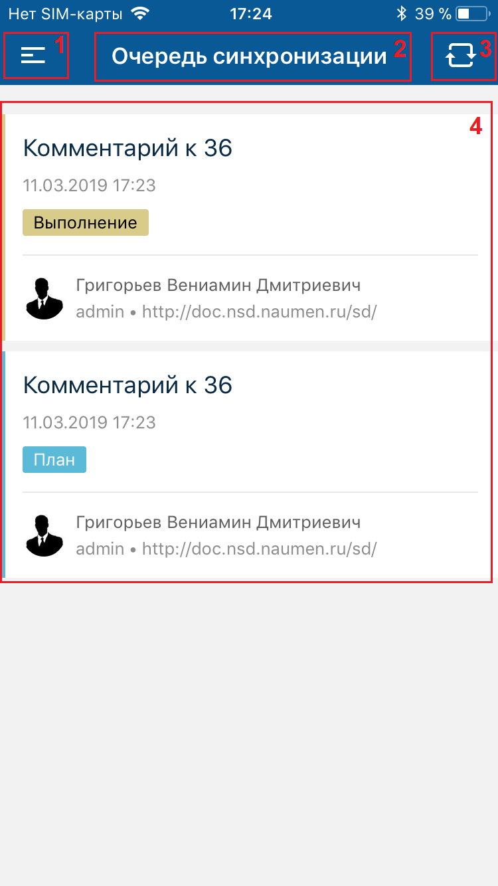
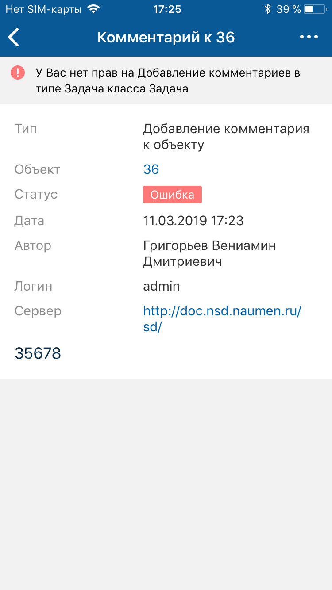
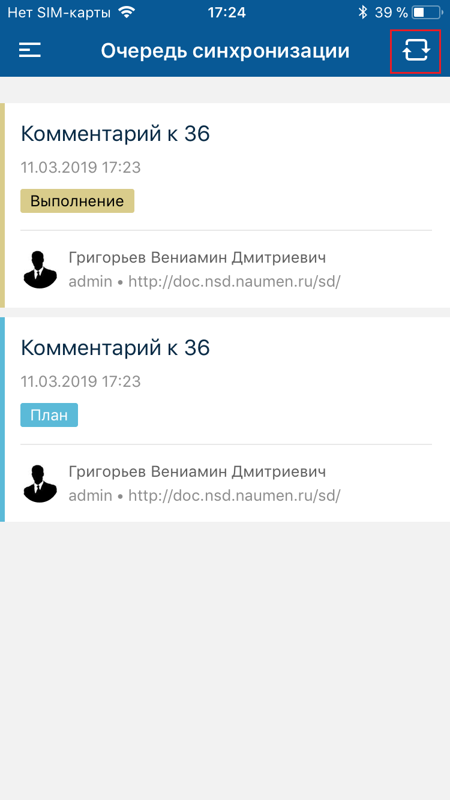
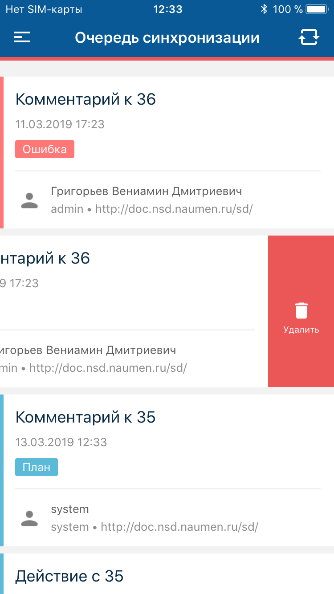
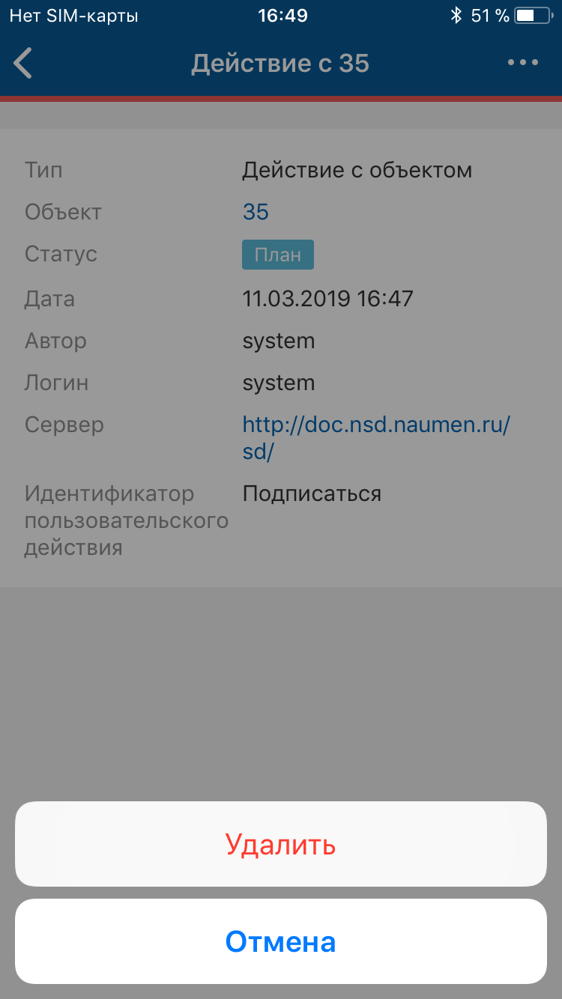
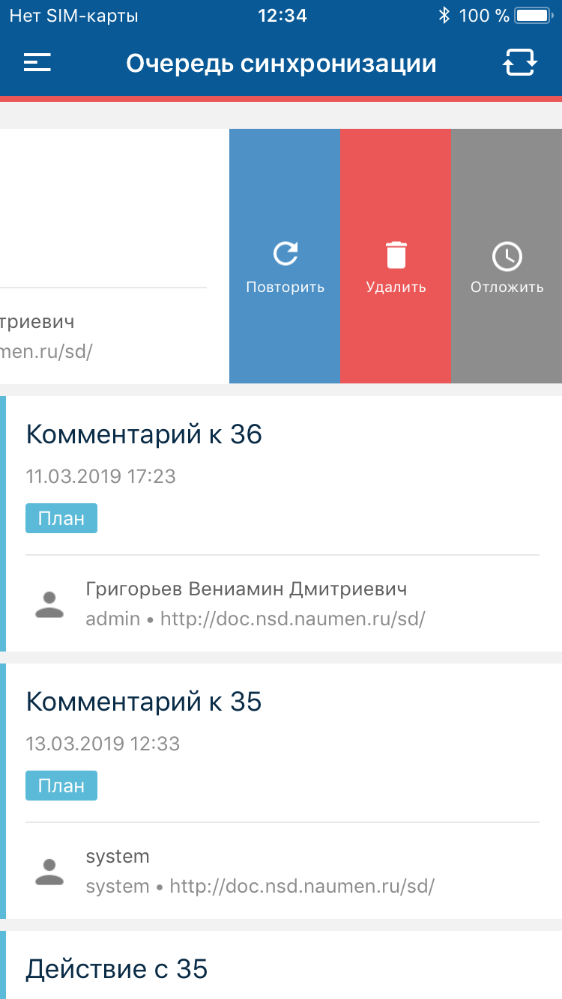
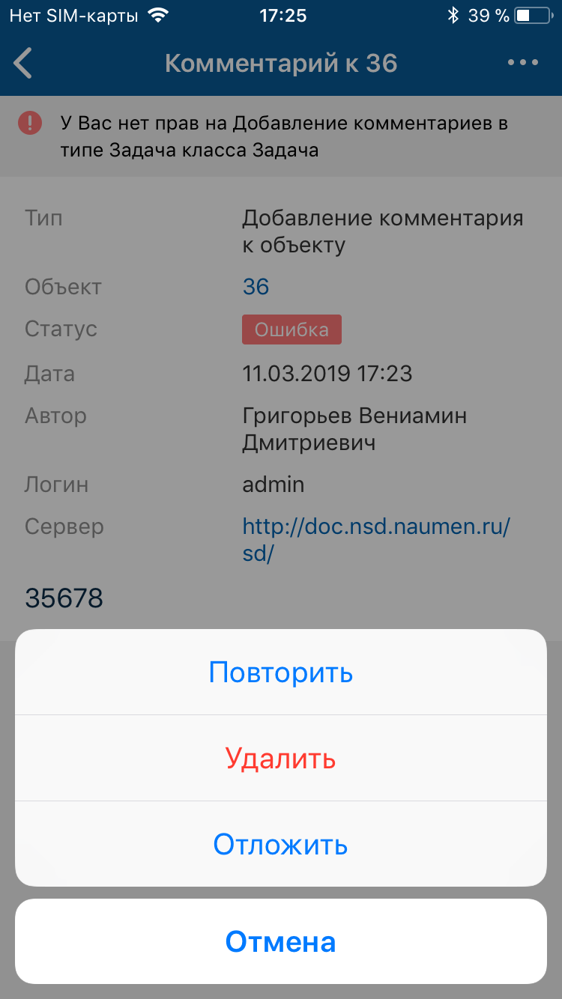

# Очередь синхронизации. iOS

[Для Android](../../../how-to-use-2/navigation-2/settings-2/sync-queue-2)

- [Просмотр очереди синхронизации](#view)
- [Запуск синхронизации](#start)
- [Удаление действия из очереди синхронизации](#dell)
- [Обработка ошибок синхронизации](#error)

### Просмотр очереди синхронизации

В очередь синхронизации попадают действия, выполненные в офлайн-режиме, со всех аккаунтов.

### Экран "Очередь синхронизации"

#### Переход к экрану

Меню мобильного приложения "Очередь синхронизации".

#### Содержание экрана

- Список действий в очереди. Элементы списка разделены на отдельные блоки.

    Для каждого действия отображается: название действия, дата и время помещения действия в очередь, статус действия и аккаунт, от которого было инициировано выполнение действия.

#### Навигация на экране

- Иконка вызова меню.
- Иконка "Синхронизировать" для запуска вручную процесса разбора очереди синхронизации.

### Экран элемента очереди

#### Переход к экрану

Меню мобильного приложения "Очередь синхронизации" → экран "Очередь синхронизации".

#### Содержание экрана

Параметры элемента очереди синхронизации.

#### Навигация на экране

- Иконка возврата к предыдущему экрану.
- Иконка вызова меню.

### Запуск синхронизации

#### Описание

Очередь разбирается по порядку сверху-вниз от наиболее старого события к самому новому. Действия выполняются в том порядке, в котором они были занесены в очередь. Для сохранения порядка выполнения действий, новое действие не запускается до тех пор, пока не обработано предыдущее действие.

<note type="info">

Процесс разбора очереди синхронизации запускается при наличии подключения (периодически с частотой запуска от 30 минут и более), а также после установки новой версии мобильного приложения и при каждом переходе из офлайн-режима в онлайн.
В процессе разбора очереди мобильное приложение может работать в фоновом режиме.

</note>

#### Место в интерфейсе

Меню мобильного приложения "Очередь синхронизации" → экран "Очередь синхронизации".

#### Выполнение действия

Нажмите иконку "Синхронизировать" на экране "Очередь синхронизации".

### Удаление действия из очереди синхронизации

#### Место в интерфейсе

- Экран "Очередь синхронизации".
- Экран элемента очереди

#### Выполнение действия

На экране "Очередь синхронизации" проведите справа-налево над блоком с описанием действия и нажмите **Удалить**.

На экране элемента очереди разверните меню и выберите **Удалить**.

### Обработка ошибок синхронизации

#### Место в интерфейсе

- Экран "Очередь синхронизации".
- Экран элемента очереди

#### Выполнение действия

На экране "Очередь синхронизации" проведите справа-налево над блоком действия с ошибкой и нажмите одну из кнопок:

- **Повторить** — действие запускается повторно еще один раз, без дополнительных автоматических повторов в случае ошибки.
- **Удалить** — действие удаляется из очереди.
- **Отложить** — действие переводится в статус "Отложено" и пропускается в текущем разборе очереди.

На карточке элемента очереди сообщение об ошибке отображается под верхней панелью. Чтобы обработать ошибку, разверните меню и выберите **Повторить**, **Удалить** или **Отложить**.

